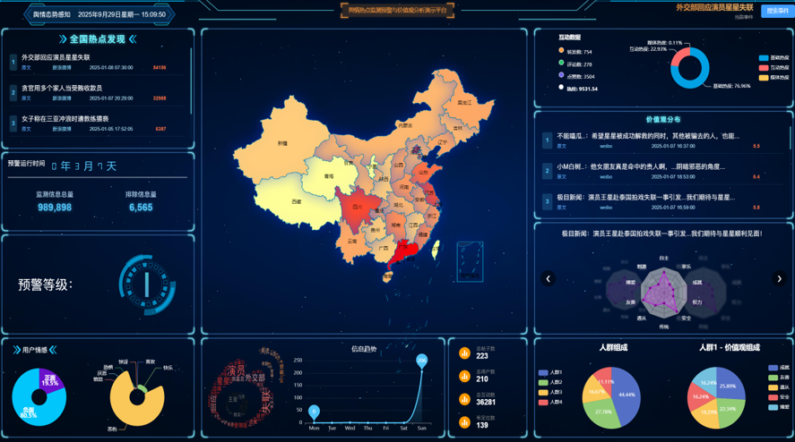

# 网络舆情热点监测预警与价值观分析平台 (Network Public Opinion Analysis Platform)

> **项目定位**：基于多维数据分析与深度学习技术的网络舆情监测、预警及价值观分析系统。

## 📖 项目简介
本项目对应“网络舆情热点监测预警与价值观分析平台构建与集成”课题。平台采用分层架构设计，实现了从数据持久化、核心算法处理到前端可视化展示的完整闭环。

**核心能力：**
- **全国热点发现**：实时监测并展示全国范围内的热点事件。
- **多维数据分析**：集成媒体热度、互动数据、用户情感倾向及**价值观分布**。
- **趋势预测与预警**：基于时间序列的热度预测与分级预警机制。

---

## 🏗 系统架构与代码映射 (System Architecture)

本项目代码仓库主要包含 **应用服务层**、**数据持久层** 和 **前端展示层**，与系统汇报PPT架构严格对应（注：数据采集层独立于本项目之外）。

### 1. 应用服务层 (Application Service Layer)
**对应目录：** [`/Service`](./Service)
> **功能描述**：基于 Python Flask 框架开发，作为系统的核心大脑，负责调度核心算法引擎，处理聚类、情感分析、价值观计算等高算力任务。

* **核心算法引擎映射**：
    * **聚类热度子服务**：`hot_cluster_service.py` —— 实现海量碎片化信息的聚类，发现热点事件。
    * **情感舆情子服务**：`yuqing_emotion_service.py` —— 负责文本的情绪倾向性计算。
    * **价值观子服务**：`value_baseinfo_service.py` —— 基于施瓦茨价值观理论的群体价值观特征提取。
    * **总服务入口**：`service_api.py` —— 统一的算法微服务接口网关。

### 2. 数据持久层 & 前端展示层 (Data Persistence & Frontend)
**对应目录：** [`/Data_Frontend`](./Data_Frontend)
> **功能描述**：负责数据的结构化存储、业务逻辑API响应以及用户交互界面的呈现。

* **数据持久层 (Database)**：
    * **数据库结构**：[`init.sql`](./Data_Frontend/init.sql) —— 包含 `hot_things` (热点事件)、`population_values` (人群价值观)、`typical_radar` (雷达图数据) 等核心表结构设计。
    * **ORM映射**：`api/database.py` —— 数据库连接与模型映射。

* **前端展示层 (Frontend)**：
    * **静态入口**：`client/index.html` —— Vue3 应用入口。
    * **构建资源**：`client/assets/` —— 包含编译后的 CSS/JS 及可视化所需的静态资源（如字体、背景图）。
    * **业务API**：`api/app.py` —— 处理前端请求，连接数据库与算法服务的中间层业务逻辑。

---

## ✨ 亮点与创新

### 🚀 1. 分层架构设计
* 平台采用分层架构设计，包含数据采集层、数据持久层、应用服务层、前端展示层以及核心算法引擎等部分

### 📊 2. 精美前端设计

---

## 🛠️ 部署说明 (Deployment)

### 环境依赖
* **数据库**：MySQL 8.0+
* **后端语言**：Python 3.8+ (Flask, Pandas, PyTorch/TensorFlow)
* **Web服务器**：Nginx (配置文件见 [`nginx.conf`](./Data_Frontend/nginx.conf))

### 详细启动指南
1.  **启动算法服务层**：参考 `Service/README.md`。
2.  **启动数据持久层、前端展示层**：参考 `Data_Frontend/README.md` 中的详细部署教程
